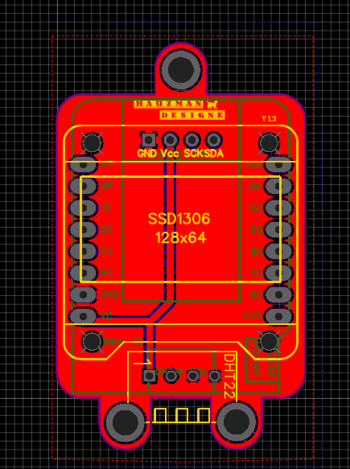
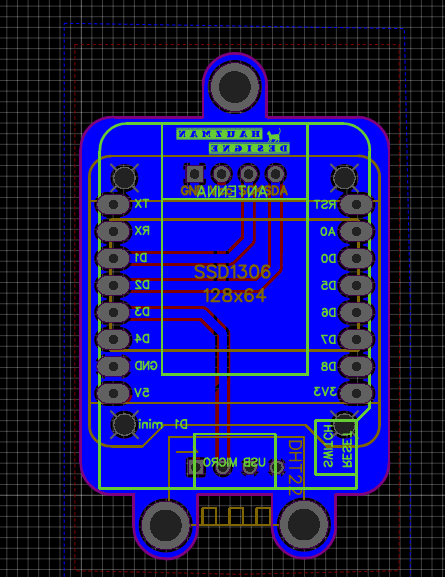

# Home Assistant - TEMPERATURE SENSOR

**Temperature_Sensor_with_Oled_0.69"**

**This is PCB for a small temperature senzor with a 0.96" oled display.**

**The software is not made by me I just adapted to my needs, you can make the same.**

**It can be integrated in Home Assistant.**

# Hardware  

The PCB was ordered from JLCPC 
- **https://jlcpcb.com**

You can find the link also the EasyEDA File

- **https://easyeda.com/tiraalexandru/DHT-Oled-tmp-sensor**

**PCB Top**                      |  **PCB_Bottom**   
:---------------------------:|:-------------------------------------:
|  

# BOM 
 
 **Name** | **Designator** | **Quantity**
:---: | :--------: | --------:
096"  |OLED-SSD1306|1
WEMOS D1 MINI |WEMOS D1 MINI V2.3.0 1.74MM|1
DHT22|U1|1

# Library Needed 
**Name** | **Link** | **Version** 
:------: | :------: | -----------:
NTPClient | [GIT](https://github.com/arduino-libraries/NTPClient) |**`3.2.0`**
ESP8266WebServer | [GIT](https://github.com/esp8266/Arduino/tree/master/libraries/ESP8266WebServer)| **`1.0`**
WiFiManager | [GIT](https://github.com/tzapu/WiFiManager) | **`0.14`**
Arduino Json | [ARDUINO IDE](https://arduinojson.org) |**`6.x.`**
PubSubClient | [GIT](https://github.com/knolleary/pubsubclient)| **`2.7`**
//Arduino Temperature Control Library- | [GIT](https://github.com/milesburton/Arduino-Temperature-Control-Library) | **`3.8.0`**
DHT | [GIT](https://github.com/adafruit/DHT-sensor-library) | **`1.3.4`**
U8g2lib - 0.96" oled| [ARDUINO LIB](https://www.arduinolibraries.info/libraries/u8g2 ) | **`U8g2-2.23.18`**
OneWire | [ARDUINO LIB](https://www.arduinolibraries.info/libraries/one-wire) | **`OneWire-2.3.5`**
DallasTemperature| [GIT](https://github.com/milesburton/Arduino-Temperature-Control-Library) | **`3.8.0`**
Adafruit_HTU21DF| [GIT](https://github.com/adafruit/Adafruit_HTU21DF_Library) | **`1.02`**
DallasTemperature| [GIT](https://github.com/milesburton/Arduino-Temperature-Control-Library) | **`latest`**
Adafruit_HTU21DF| [GIT](https://github.com/adafruit/Adafruit_HTU21DF_Library) | **`latest`**
Adafruit_APDS9960|[GIT](https://github.com/adafruit/Adafruit_APDS9960) | **`1.1.1`**
Adafruit_Sensor| Instal from library **"Adafruit Unified Sensor"** by Adafruit | **`1.0.2`**
Adafruit_BMP085_U| [GIT](https://github.com/adafruit/Adafruit_BMP085_Unified) | **`1.0.0`**
DNSServer| Instal from library | **`1.1.1`**
ESP8266HTTPClient| [GIT](https://github.com/esp8266/Arduino/blob/master/libraries/ESP8266HTTPClient) | **`1.2`**
ESP8266httpUpdate| [GIT](https://github.com/Links2004/Arduino/tree/esp8266/hardware/esp8266com/esp8266/libraries/ESP8266httpUpdate) | **`1.2`**
ESP8266WiFi| Instal from library | **`1.0`**
SPI| [ARDUINO](http://arduino.cc/en/Reference/SPI) | **`1.0`**
Wire| [ARDUINO](http://arduino.cc/en/Reference/Wire) | **`1.0`**
